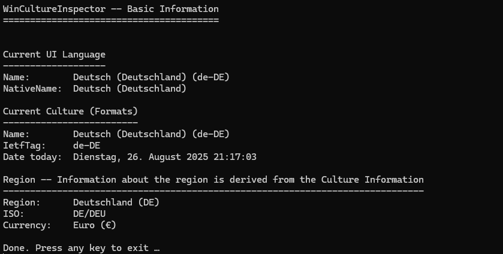

# WinCultureInspector

A lightweight Windows console tool to inspect **system locale, culture, region, and UI language** settings.  
Useful for developers and testers who need to verify language/region settings, debug globalization issues, or test apps with tools like [Locale Emulator](https://github.com/xupefei/Locale-Emulator).

---

## ✨ Features

- ✅ Show current **UI language** (`CurrentUICulture`)
- ✅ Show current **culture/formatting settings** (`CurrentCulture`)
    - Currency formatting
    - Date/Time formatting
- ✅ Show **region information** (country, ISO codes, currency)

---

## 📷 Example Output

Here is an example of the console output (your system will differ):



---

## 🔧 Usage

### Run from console
```bash
WinCultureInspector.exe
```

The program will print system locale information and wait for a key press before exiting.

### Example
```text
WinCultureInspector – Basic Information
=======================================

Current UI Language
-------------------
Name:        English (United States) (en-US)
NativeName:  English (United States)

Current Culture (Formats)
-------------------------
Name:        English (Germany) (en-DE)
IetfTag:     en-DE
Date today:  Monday, 26 August 2025 16:42:12

Region — Information about the region is derived from the Culture Information
----------------------------------------------------------------------------
Region:      Germany (DE)
ISO:         DE/DEU
Currency:    Euro (€)
```

---

## 💡 Use Cases

- Check if your **Windows locale settings** are applied correctly.
- Debug globalization/localization issues in .NET applications.
- Inspect how dates, and currencies are formatted.
- Verify environment when testing with **Locale Emulator**.
- Quick system info tool for developers and testers.

---

## 📦 Installation

Download the latest version from the [Releases page](https://github.com/Vlas-20/WinCultureInspector/releases).

### Available builds
- [WinCultureInspector-v0.1.0-win-x86-sc.zip](https://github.com/Vlas-20/WinCultureInspector/releases/download/v0.1.0/WinCultureInspector-v0.1.0-win-x86-sc.zip)  
  *(32-bit, required for Locale Emulator, works on all Windows systems)*

- [WinCultureInspector-v0.1.0-win-x64-sc.zip](https://github.com/Vlas-20/WinCultureInspector/releases/download/v0.1.0/WinCultureInspector-v0.1.0-win-x64-sc.zip)  
  *(64-bit, recommended for modern Windows systems)*

Just download, extract, and run `WinCultureInspector.exe`.  
No .NET installation required (self-contained build).

---

## 🤝 Contributing

Ideas and feedback are welcome!  
If you have an idea for a new feature or notice something that could be improved:

- Open an [Issue](https://github.com/Vlas-20/WinCultureInspector/issues) to suggest a feature or report a bug  

Even small improvements like better documentation, new examples, or code cleanups are appreciated!

---

## 📜 License

This project is licensed under the [MIT License](LICENSE).

---

## 🔎 Keywords

windows locale, windows culture inspector, cultureinfo, region info, dotnet globalization tool, c# system locale utility, check windows language settings, windows international settings, region and language inspector, debug localization in .NET, inspect windows ui language, system culture diagnostic, language and currency format checker, multi-language support debugging, locale configuration viewer, windows cultureinfo viewer, check default system culture, dotnet culture and region info, i18n debugging tool for windows, localization debugging, globalization debugging, windows region settings, locale emulator test tool
